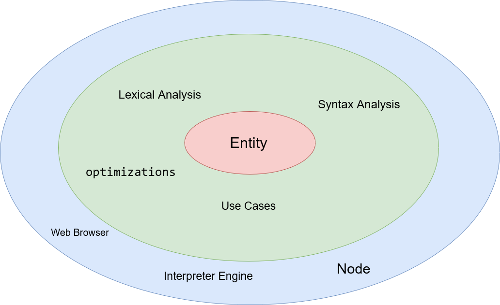

# Lexical Analaysis separation
    Keywords: reserved words with a specific meaning in the language. Examples include begin, end, if, then, else, repeat, until, while, and do.

    Identifiers: user-defined names for variables, procedures, and functions. Identifiers must start with a letter and may include letters, digits, and underscores.

    Operators: symbols used to perform arithmetic and logical operations. Examples include +, -, *, /, =, <>, <, >, <=, >=, and, or, not.

    Delimiters: symbols used to separate elements in the code. Examples include ,, :, ;, ., (, ), [, ], {, }.

    Literals: values that represent a specific data type. Examples include integers (123), real numbers (3.14), characters ('a'), and strings ('Hello, World!').

    Comments: text in the code that is ignored by the compiler. Comments start with // for single-line comments or { and } for multi-line comments.

    Directives: special commands that are used to control the compiler. Directives start with {$ and end with }. Examples include {$I} to include a file, {$R} to include a resource, and {$IFDEF} and {$ENDIF} to conditionally include code.